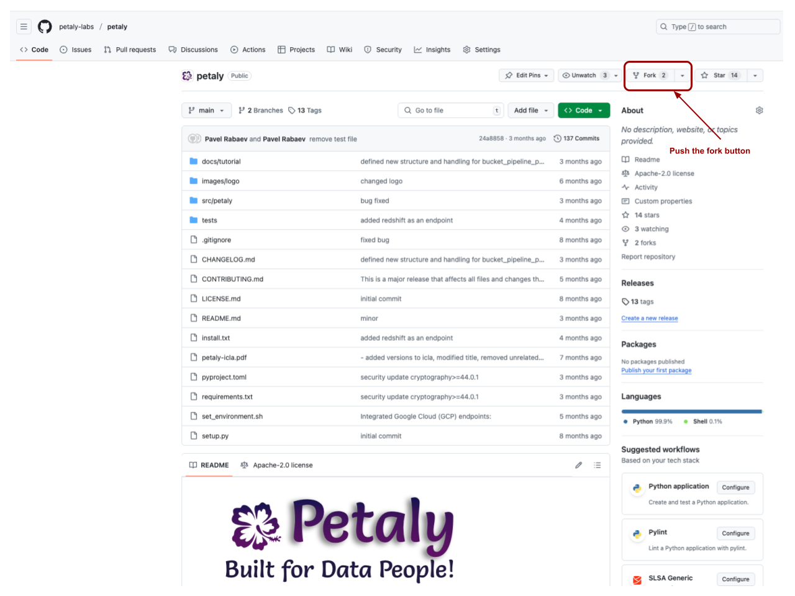
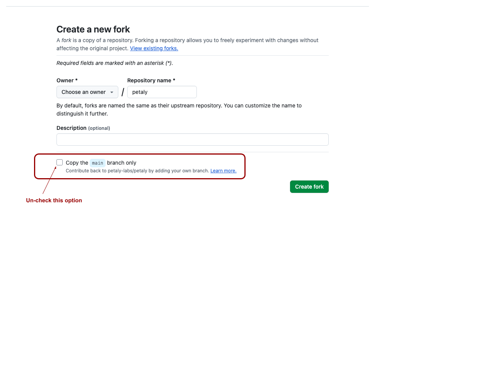
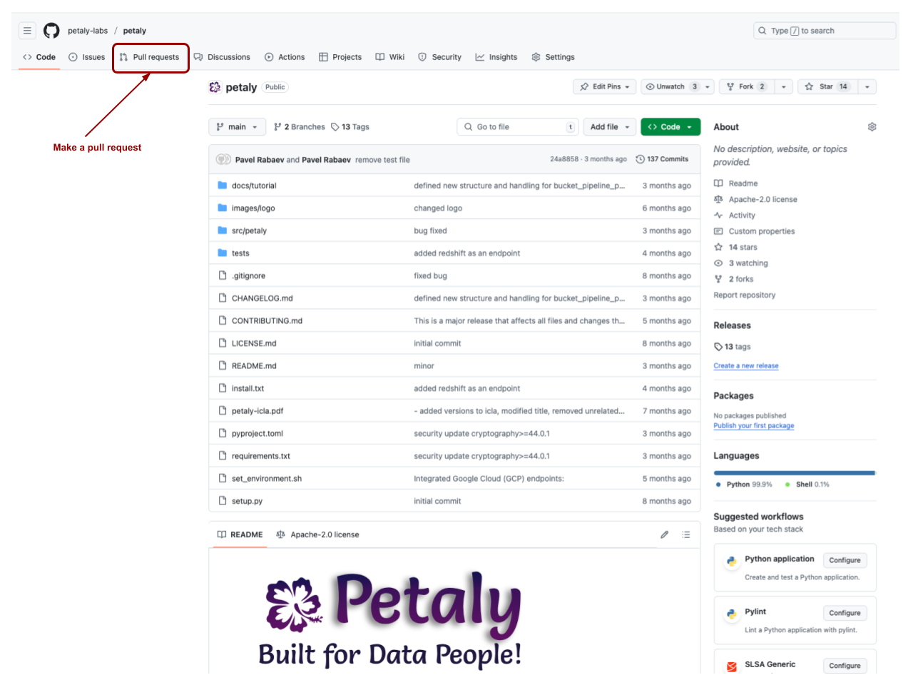

# Contributing to Petaly  

Welcome to the Petaly community! We're thrilled to have you here and excited about the possibility of your contributions to our project. Whether you're a seasoned developer, designer, writer, or someone just starting in open source, your involvement is invaluable to us.

## Table of Contents
- [Getting Started](#getting-started)
- [Setting Up Your Environment](#setting-up-your-environment)
- [Working with Forks](#working-with-forks)
- [Keeping Your Fork in Sync](#keeping-your-fork-in-sync)
- [Submitting Changes](#submitting-changes)
- [How You Can Contribute](#how-you-can-contribute)
- [Our Values](#our-values)
- [Legal Requirements](#legal-requirements)

## Getting Started

### 1. Read the Documentation
Before contributing, please read through this guide and our Code of Conduct to understand how we work together.

### 2. Explore Issues
Take a look at our open issues in the Issues Tab. We have labels to help you find the right fit, from beginner-friendly issues to more complex challenges. Your questions, ideas, and feedback are always welcome.

## Setting Up Your Environment

To get started, ensure you have the necessary resources installed:
- MySQL server and/or PostgreSQL server
- You can install these locally or use Docker

## Working with Forks

### 1. Fork the Repository
- Navigate to the Petaly GitHub repository and fork the **`devel`** branch to your GitHub account
- Before forking, ensure you check the 'Copy the main branch only' option
- It's recommended to rename the target repository to include your initials (e.g., 'petaly-pr' for Pavel Rabaev) to avoid confusion during later merges

Here's how to fork the repository:



When forking, make sure to:
1. Check 'Copy the main branch only' option
2. Rename the repository to include your initials (e.g., 'petaly-pr' for Pavel Rabaev)



### 2. Clone Your Fork Locally
```bash
git clone git@github.com:[your-username]/[your-repository-name].git
```

### 3. Checkout the `devel` Branch
```bash
git branch
git checkout devel
```

## Keeping Your Fork in Sync

### 1. Set Up Upstream
```bash
git remote add upstream git@github.com:petaly-labs/petaly.git
```

### 2. Verify Upstream
```bash
git remote -v
```

### 3. Fetch Updates
```bash
git fetch upstream
```

### 4. Merge Updates
```bash
git merge upstream/devel
```

### 5. Push Changes to Your Fork
```bash
git push origin devel
```

## Submitting Changes

Once your changes are ready:
1. Navigate to the GitHub web interface
2. Create a Pull Request (PR) to the Petaly repository from your fork
3. Ensure your PR description clearly explains the changes and references any related issues

Here's how to create a pull request:



For more detailed information about creating pull requests, check out the [DigitalOcean tutorial](https://www.digitalocean.com/community/tutorials/how-to-create-a-pull-request-on-github).

## How You Can Contribute

There are many ways to contribute to Petaly:

- **Code Contributions**: Pick up a bug, feature request, or improvement from the issue tracker
- **Documentation**: Help us improve our guides and documentation
- **Testing and Feedback**: Test new features and report bugs
- **Community Support**: Answer questions, suggest new features, and help other contributors

## Our Values

Petaly thrives on collaboration, respect, and inclusivity. We are committed to creating a safe and positive environment for everyone. Your contributions make Petaly better, and we are here to support you every step of the way.

## Legal Requirements

Before your first contribution can be merged, you'll need to complete our Individual Contributor License Agreement (CLA). This helps us maintain the project's integrity and protect both contributors and users. Request a digital form by emailing contact@petaly.org

## Need Help?

If you have any questions, feel free to:
- Reach out via our GitHub discussions
- Open an issue on our GitHub repository
- Email us at contact@petaly.org

## Thank You!

Thank you for being a part of the Petaly community. We can't wait to see the amazing things we'll build together!

Happy coding! 🌱 